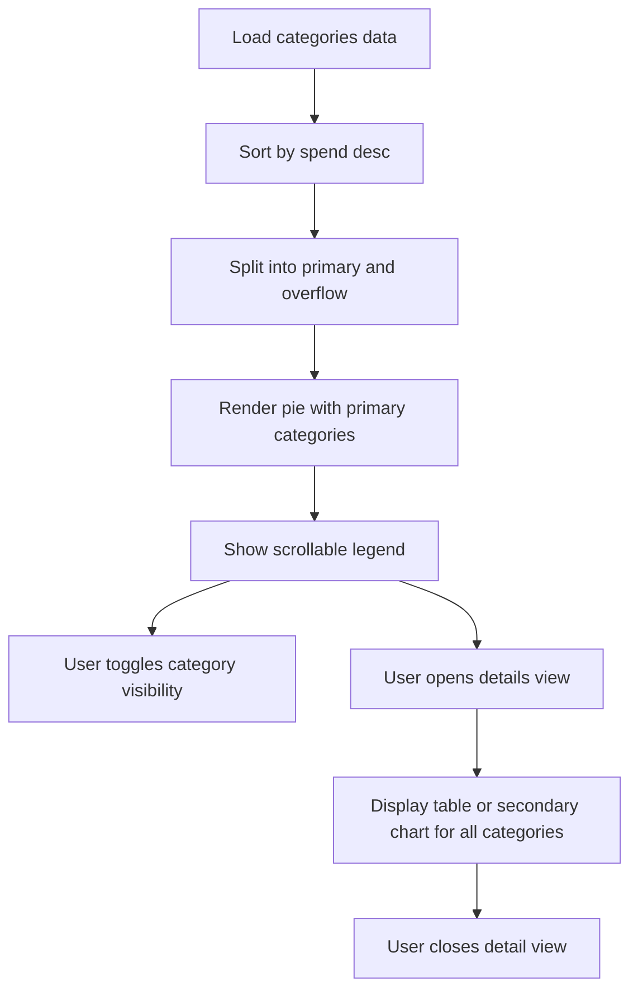

# Expenses by Category Chart: Large Dataset Strategy

## Context

- Current pie chart in [`src/components/Dashboard/ExpensesByCategoryChart/ExpensesByCategoryChart.tsx`](src/components/Dashboard/ExpensesByCategoryChart/ExpensesByCategoryChart.tsx) renders every category simultaneously with a static radius and legend.
- Real data exceeds 15 categories, and stakeholders need to interact with each individual category even on smaller screens.

## Challenges

1. Overcrowded labels and legend entries reduce readability.
2. Slice sizes become too thin to interact with when many categories exist.
3. Mobile layouts have limited width and height for both visualization and controls.

## Recommended Strategy

### 1. Layered summarization with drill-down

- Render top _N_ categories (e.g., 6 to 8) plus an `Other` slice aggregating the remainder to keep the primary pie legible.
- Provide a detail panel (drawer, modal, or stacked list) that shows a sortable table for every category when the user taps a slice/legend item or clicks `View all categories`.
- Preserve direct access by allowing users to expand `Other` into an interactive secondary chart (e.g., donut drill-down or radial bar list).

### 2. Interactive legend management

- Replace the default legend with a scrollable, filterable legend component positioned beside or beneath the chart.
- Support toggling categories on/off from the legend to simplify the chart on demand.
- Add a search input above the legend for quick access when dozens of categories exist.

### 3. Alternative chart modes for dense data

- Provide a view toggle between the existing pie and a horizontal stacked bar or tree map; bars scale better for many categories.
- Persist the user1s selection in local storage to respect personal preference.

### 4. Responsive layout adjustments

- **≥1024px**: Use a split layout with the pie on the left and a vertical legend/table on the right occupying equal height, leveraging the available width.
- **768px–1023px**: Stack the pie on top with a horizontal tab control (`Chart` / `Details`) to prevent vertical overflow.
- **<768px**: Prioritize an accessible summary card view first (total spend, top three categories) followed by a collapsible section containing the interactive legend list; convert the chart to a radial progress list or swipeable carousel of bars to maintain tap targets.

### 5. Accessibility & usability

- Increase minimum slice thickness by enforcing a lower bound on `value` displayed and transferring marginal categories into list-only detail views.
- Use tooltips with clear currency formatting and percentage plus amount.
- Expose keyboard shortcuts or buttons for cycling through categories when the legend overflows.

## Suggested Implementation Steps

1. Introduce a chart controller hook (e.g., `useExpensesByCategoryView`) that:
   - Sorts categories by spend.
   - Chunks data into `primary` (top N) and `overflow` arrays.
   - Manages UI state (selected view mode, active category, legend filters).
2. Build a `LegendPanel` component with search, toggle, and scroll capabilities, co-located in the chart folder.
3. Add a `DetailsDrawer` component for full-category inspection and drill-down rendering.
4. Wire breakpoint-aware layouts via CSS grid utilities and conditional rendering (Tailwind or CSS modules).
5. Provide feature flags or props so other surfaces (e.g., statistics page) can reuse the chart logic with different thresholds.

## Interaction Flow

## Success Criteria

- Primary chart never shows more than ~8 slices at once.
- Legend remains navigable without clipping on 320px width devices.
- Users can reach any category within two interactions (toggle, search, drill-down).
- Mobile tap targets meet WCAG 2.1 AA size guidance (48 px touch areas).

## Implementation Status (November 2025)

- ✅ Top-`N` plus overflow summarization, searchable legend, and details drawer are live inside [`ExpensesByCategoryChart.tsx`](src/components/Dashboard/ExpensesByCategoryChart/ExpensesByCategoryChart.tsx:37) backed by [`use-category-chart-controller.ts`](src/hooks/use-category-chart-controller.ts:58).
- ✅ Dedicated UI primitives (`LegendPanel`, `DetailsDialog`, `ListView`, `ChartViewToggle`) now encapsulate controls and are re-used across both dashboard and analytics surfaces.
- ✅ Responsive split layouts and stacked fallbacks reflect the plan’s breakpoint guidance, and the Statistics tab consumes the same chart component for a unified experience.
- ✅ A lightweight summary widget on the dashboard highlights the top categories and deep-links to the comprehensive analytics tab.
- ✅ Overflow slice metadata (`children`) powers the drill-down table and “show all slices” toggle, ensuring marginal categories stay accessible even when collapsed.

## Future Enhancements

1. **Persist user preferences** – Remember the selected view (`pie` vs. `list`) and “show all slices” state via local storage to avoid resetting context between visits.
2. **Inline “Other” drill-down** – Expand the aggregated slice in-place (e.g., mini chart or stacked list) so users can inspect overflow data without opening the dialog.
3. **Legend power tools** – Add quick filters/sorts (top 5 only, alphabetical mode, income vs. expense) next to the search bar for faster triage when dozens of categories exist.
4. **Contextual KPIs** – Display MoM total spend deltas or highlight the largest contributor inside the card header to provide more context at a glance.
5. **Accessibility polish** – Announce visibility toggles via `aria-live`, offer a high-contrast palette fallback, and expose keyboard shortcuts for traversing long legend lists.
